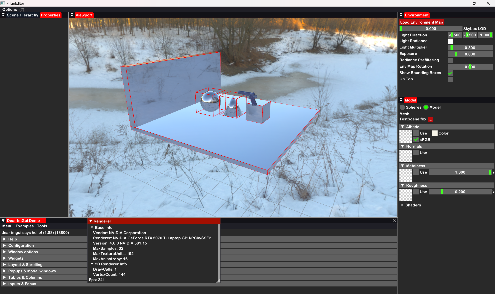
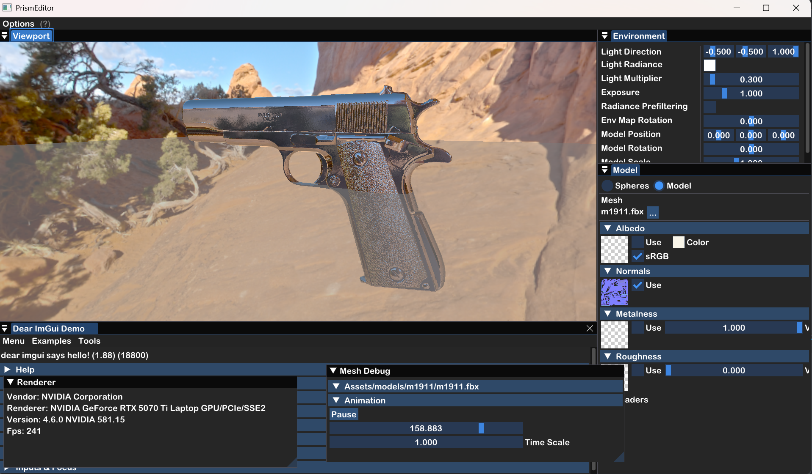

# Prism Engine


**Prism** 是一个轻量级、模块化、用 C++ 开发的跨平台游戏引擎，渲染后端使用 **OpenGL**（目前采用现代 OpenGL API，如 glCreateBuffer、glCreateVertexArrays 等）。

**注意：最新开发进度请切换到 `Prism3D` 分支**（`git checkout Prism3D`），所有最新提交均在此分支。

目前处于早期开发阶段，已实现基础渲染管线、Shader 管理、Vertex Array 封装、日志系统、Scene 系统、Renderer2D、Compute Shader 支持等。目标是打造一个清晰、易扩展、高性能的引擎，适合学习和小型游戏开发。

## 🛠 快速开始

### 1. 克隆仓库（包含子模块）

```bash
git clone --recursive https://github.com/HMsabachi/Prism.git
cd Prism
git checkout Prism3D   # 切换到最新开发分支
```

### 2. 生成项目文件

- **Windows**：双击运行 `GenerateProjects.bat`（推荐）
- **其他平台**：手动执行

```bash
premake5 vs2022        # Windows Visual Studio
premake5 gmake         # Linux / macOS Makefile
premake5 xcode4        # macOS Xcode
```

### 3. 编译并运行

打开生成的解决方案（或 Makefile），编译 `SandBox` 项目并运行，即可看到最新渲染结果（包含 Scene、Renderer2D、Compute Shader 等演示）。

## 📸 截图 / 演示




## ⚙️ 规划与实现

- [ ] 资源管理系统
- [ ] 场景图与实体组件系统（ECS）（Scene 系统已初步实现）
- [ ] 物理系统集成
- [x] 编辑器界面 (正在进行)
  - [x] PrismEditor 项目
  - [x] 基础组件 + 场景层级面板 + ImGuizmo
- [x] 3D 渲染管线 (正在进行)
  - [x] 材质系统（Material/Instance）
  - [x] 重构Shader以支持**PSL**(*Prism Shader Language*) 并完成全部着色器转换
  - [x] Shader Property 系统
  - [x] Transform
  - [x] RenderPass 系统
  - [x] Compute Shader（支持多纹理与 PBR 预处理）
  - [x] SSBO（Shader Storage Buffer Object）
  - [x] HDR 渲染
  - [x] MSAA（多重采样帧缓冲）
- [x] 相机系统
  - [x] 正交相机
  - [x] 透视相机
- [x] Renderer2D 模块（含 AABB 可视化调试）
- [x] Scene 系统（场景管理核心）
- [x] Time 系统
- [x] Shader 管理
- [x] Vertex Array 封装
- [x] 日志系统
- [x] 跨平台构建支持

## ✨ 特性（当前已实现）

- **OpenGL 现代渲染管线**  
  - OpenGL 上下文封装（使用新版 API）  
  - OpenGLShader 类（完整支持 PSL）  
  - Vertex Array / Vertex Buffer / Index Buffer 抽象  
  - Compute Shader 原生支持  
  - SSBO 支持  
  - HDR 渲染  
  - MSAA 多重采样帧缓冲  

- **Renderer2D 模块**  
  - 2D 渲染管线  
  - AABB 可视化调试支持  

- **Scene 系统**  
  - 场景管理与对象生命周期  
  - 场景层级面板（编辑器）  

- **材质与渲染架构**  
  - Material / MaterialInstance 系统  
  - RenderPass 系统  
  - 智能指针资源管理  

- **编辑器功能**  
  - ImGui 深度集成  
  - ImGuizmo 变换工具  
  - 场景层级面板  

- **数学库**：集成 GLM 数学库

- **日志系统**：底层使用 spdlog 统一日志输出，便于调试

- **构建系统**：使用 Premake 5，支持 Windows / Linux / macOS 快速生成项目文件（目前仅 Windows 完整支持）

- **Prism Shader Language (PSL)**：完整支持与扩展，所有着色器已转换为 PSL

## 🧩 技术文档
- 中文版
  - [Prism Shader 文档](docs/PrismShader.md)
  - [Time 文档](docs/Time.md)
  - [Renderer 文档](docs/Renderer.md)
- English Version
  - [Time Documentation](docs/TimeEN.md)

## 📁 项目结构

```
Prism/
├── Prism/                  # 引擎核心源码（Renderer/ 为核心渲染模块）
├── SandBox/                # 示例应用功能
│   └── src/                # Sandbox 主程序源码
├── vendor/                 # 第三方依赖
│   └── premake/            # Premake 5 构建工具
├── .gitignore
├── .gitmodules             # 子模块（当前主要包含 GLM）
├── GenerateProjects.bat    # Windows 一键生成项目文件
├── LICENSE
├── premake5.lua            # Premake 构建配置文件
└── README.md
```

> **具体代码实现建议直接查看仓库 `Prism3D` 分支最新提交**，核心渲染模块集中在 `Prism/Renderer/` 下，编辑器相关代码在 `Prism/Editor/` 下。

## 🎯 开发路线图（Roadmap）

- [ ] 跨平台窗口抽象
- [ ] 输入系统（键盘、鼠标）
- [ ] 2D 渲染管线（Sprite、Batch Rendering）（Renderer2D 已初步完成）
- [ ] 资源管理系统（Texture、Mesh、Material）
- [ ] 场景图与实体组件系统（ECS）（Scene 已实现基础）
- [ ] 物理系统集成
- [ ] 编辑器界面（ImGui 进一步扩展）
- [ ] Vulkan 后端支持（长期目标）

欢迎参与贡献，一起完善 Prism！

## 🤝 贡献指南

1. Fork 本仓库
2. 创建特性分支 (`git checkout -b feature/AmazingFeature`)
3. 提交更改 (`git commit -m 'Add some AmazingFeature'`)
4. 推送分支 (`git push origin feature/AmazingFeature`)
5. 开启 Pull Request

欢迎任何形式的 Issue 和 PR！

## 📄 许可证

本项目采用 **Apache License 2.0** 许可证。  
详见 [LICENSE](LICENSE) 文件。

---

喜欢这个项目？欢迎点个 ⭐ 支持一下！

## 参考资料
- [Hazel Engine](https://github.com/TheCherno/Hazel)
- [LearnOpenGL CN](https://learnopengl-cn.github.io/)
- [spdlog](https://github.com/gabime/spdlog)    
- [Premake 5](https://premake.github.io/)
- [GLM](https://github.com/g-truc/glm)
- [ImGui](https://github.com/ocornut/imgui) 

---

