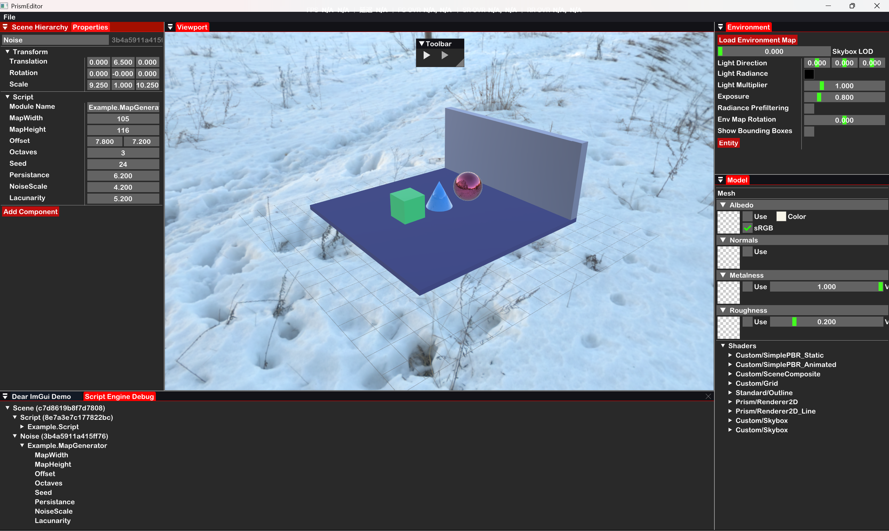
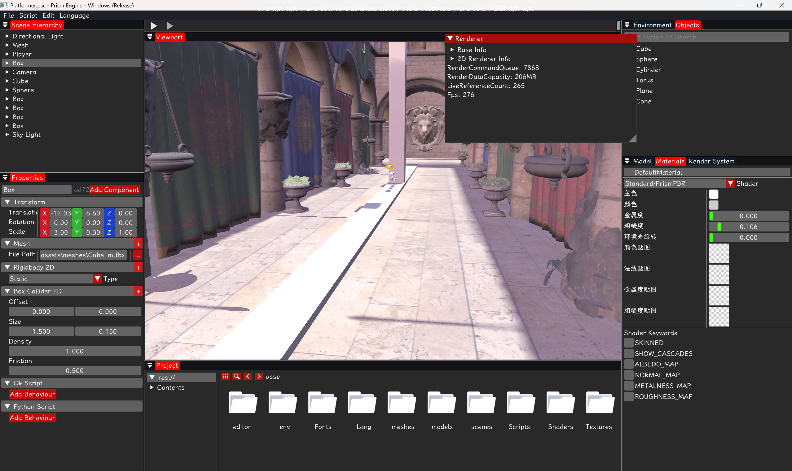

# Prism Engine


**Prism** 是一个轻量级、模块化、用 **C++17** 开发的跨平台游戏引擎。渲染后端使用 **OpenGL**（现代 API，如 `glCreateBuffer`、`glCreateVertexArrays` 等），**C# 脚本系统**基于 **.NET 9** 与 **Rolky** 互操作框架，编辑器使用 **ImGui** 构建。

> **注意：最新开发进度请切换到 `Prism3D` 分支**（`git checkout Prism3D`），所有最新提交均在此分支。

目前已实现现代渲染管线（PBR + HDR + MSAA + Compute Shader）、Scene 系统、基于 entt 的 ECS 架构、C# 脚本系统、ImGui 编辑器框架等功能。目标是打造一个清晰、易扩展、高性能的引擎，适合学习和中小型游戏开发。

## 快速开始

### 1. 克隆仓库并切换分支

```bash
git clone --recursive https://github.com/HMsabachi/Prism.git
cd Prism
git checkout Prism3D
```

### 2. 生成项目文件

- **Windows**：双击运行 `Win-GenerateProjects.bat`
- **其他平台**：手动执行

```bash
premake5 vs2022        # Windows Visual Studio
premake5 gmake         # Linux / macOS Makefile
premake5 xcode4        # macOS Xcode
```

### 3. 编译并运行

编译 `PrismEditor` 项目并运行，即可看到完整的编辑器界面，包含场景层级面板、属性面板、ImGuizmo 变换工具和视口渲染。

## 截图 / 演示





## 特性一览

### C# 脚本系统（核心特性）
- C++/C# 互操作与反射（基于 Rolky）
- .NET 9 运行时集成
- 组件化脚本开发（`OnCreate` / `OnUpdate` 生命周期）
- InternalCall 自动绑定机制
- C# 端完整 API：Input、Time、Log、Math（Vector2/3/4、Matrix4）、Renderer（Material、Mesh、Texture2D）
- 示例：程序化地形生成（MapGenerator.cs）

### 实体组件系统（ECS）
- 基于 **entt** 库
- 组件：`IDComponent`、`TagComponent`、`TransformComponent`、`MeshComponent`、`ScriptComponent`、`CameraComponent`、`SpriteRendererComponent`

### 现代 OpenGL 渲染管线
- PBR 金属/粗糙度工作流
- 计算着色器（Compute Shader）与 SSBO
- HDR 渲染 + MSAA 多重采样
- Prism Shader Language (PSL) — 自定义着色器语言，支持 Properties、RenderCommand、多 Pass
- 模板测试封装与 Stencil Buffer 物体描边（Outline）
- OpenGLStateCache 渲染状态统一管理
- RenderPass 系统与多线程命令队列
- Renderer2D + AABB 可视化调试
- Assimp 模型导入与子网格管理

### 编辑器功能（PrismEditor）
- ImGui 深度集成 + ImGuizmo 变换工具（平移/旋转/缩放）
- 场景层级面板 + 属性信息面板
- 子网格拾取与高亮支持
- 运行时场景克隆与 Play/Pause 模式
- PBR 材质参数实时调节（反照率、法线、金属度、粗糙度）
- 包围盒可视化开关

### 基础系统
- 日志系统（spdlog，多级别、格式化、NativeString 跨语言）
- 相机系统（正交/透视/编辑器自由飞行）
- 输入系统（抽象层 + Windows 实现）
- Time 系统（模仿 Unity：DeltaTime、TimeScale、FrameCount）
- YAML 配置支持 + UUID 生成
- 侵入式 Ref 智能指针
- 数学库：GLM + AABB + Ray

## 项目结构

```bash
Prism/
├── Prism/                  # 引擎核心（C++17，编译为 DLL）
│   ├── src/Prism/
│   │   ├── Core/           # 应用框架、窗口、图层、日志、输入、Time、Ref、UUID
│   │   ├── Events/         # 事件系统（窗口、键盘、鼠标）
│   │   ├── Renderer/       # 渲染抽象层（RenderPass、Material、Mesh、Texture、Shader）
│   │   ├── Renderer/Camera/# 相机系统
│   │   ├── Scene/          # 场景管理与 ECS 组件
│   │   ├── Editor/         # 编辑器工具相机和层级面板
│   │   ├── ImGui/          # ImGui 集成层
│   │   ├── Debug/          # 性能分析工具
│   │   └── Utilities/      # 工具类
│   ├── src/Platform/
│   │   ├── OpenGL/         # OpenGL 后端实现（Buffer、FBO、Shader、Texture、SSBO 等）
│   │   └── Windows/        # Windows 平台层（GLFW 窗口、输入）
│   └── src/Scripting/      # C++/C# 互操作引擎（ScriptEngine、InternalCall 注册）
│
├── Prism.Scripting/        # C# 脚本层（.NET 9 托管程序集）
│   └── src/Prism/
│       ├── Script/         # ScriptEngine、ScriptClass、ScriptInstance
│       ├── Core/           # Input、Time、Log、InternalCalls
│       ├── Math/           # Vector2/3/4、Matrix4、Noise
│       ├── Renderer/       # Color、Material、Mesh、Texture2D
│       └── Scene/          # Entity、Component
│
├── PrismEditor/            # 编辑器应用程序（ImGui + ImGuizmo）
│   └── src/                # PrismEditor.cpp、EditorLayer
│
├── ExampleApp/             # C# 示例脚本项目
│   └── src/                # Script.cs、MapGenerator.cs
├── SandBox/                # 旧版 C++ 示例（逐步淘汰）
├── vendor/                 # 第三方库
├── docs/                   # 技术文档（PSL、Time、Renderer）
├── premake5.lua            # 构建配置
├── Prism.sln               # Visual Studio C++ 解决方案
├── PrismManaged.sln        # Visual Studio C# 解决方案
└── Win-GenerateProjects.bat
```

## 技术栈

| 类别 | 技术 |
|------|------|
| 语言 | C++17、C# 12 (.NET 9) |
| 图形 API | OpenGL 4.5+ (Core Profile) |
| 窗口 | GLFW |
| 数学 | GLM |
| ECS | entt（单头文件）|
| UI | ImGui + ImGuizmo |
| 脚本互操作 | Rolky |
| 日志 | spdlog |
| 模型导入 | Assimp |
| 序列化 | yaml-cpp |
| 图像加载 | stb_image |
| 噪声 | FastNoise |
| 构建系统 | Premake 5 |
| 着色器 | Prism Shader Language (PSL) |

## 技术文档

- 中文版
  - [Prism Shader 文档](docs/PrismShader.md)
  - [Time 文档](docs/Time.md)
  - [Renderer 文档](docs/Renderer.md)
- English
  - [Time Documentation](docs/TimeEN.md)

## 开发路线图

- [ ] C# 脚本系统完善（热重载、编辑器脚本属性面板）
- [ ] 完整资源管理系统与序列化
- [ ] 物理系统集成
- [ ] 跨平台窗口与渲染抽象
- [ ] Vulkan 后端支持（长期目标）

## 许可证

本项目采用 **Apache License 2.0** 许可证。详见 [LICENSE](LICENSE) 文件。

## 参考资料

- [Hazel Engine](https://github.com/TheCherno/Hazel)
- [LearnOpenGL CN](https://learnopengl-cn.github.io/)
- [entt](https://github.com/skypjack/entt)
- [ImGui](https://github.com/ocornut/imgui)
- [spdlog](https://github.com/gabime/spdlog)
